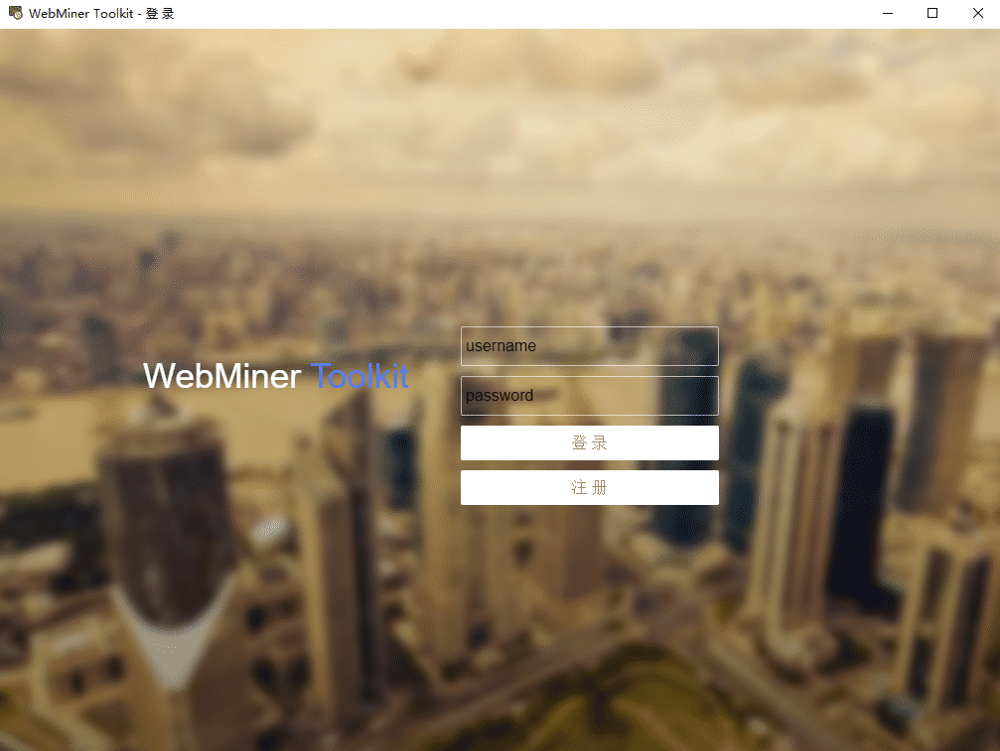
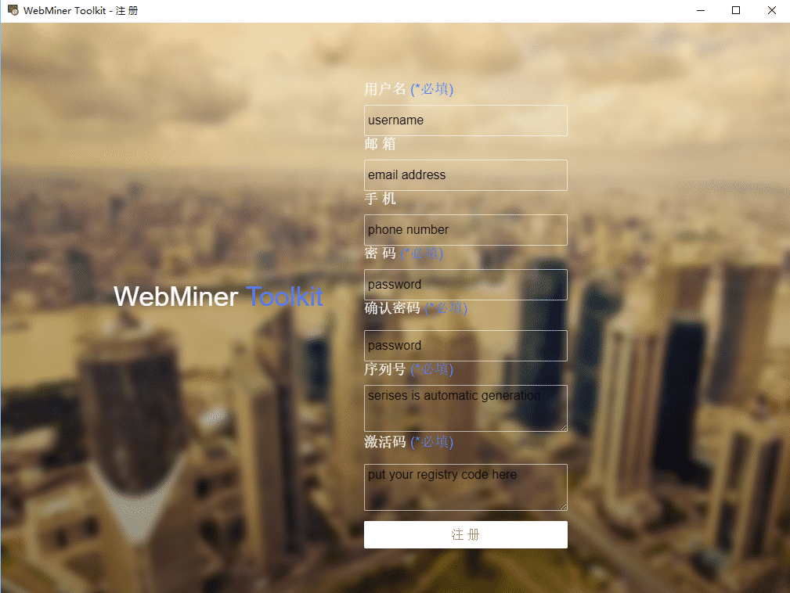
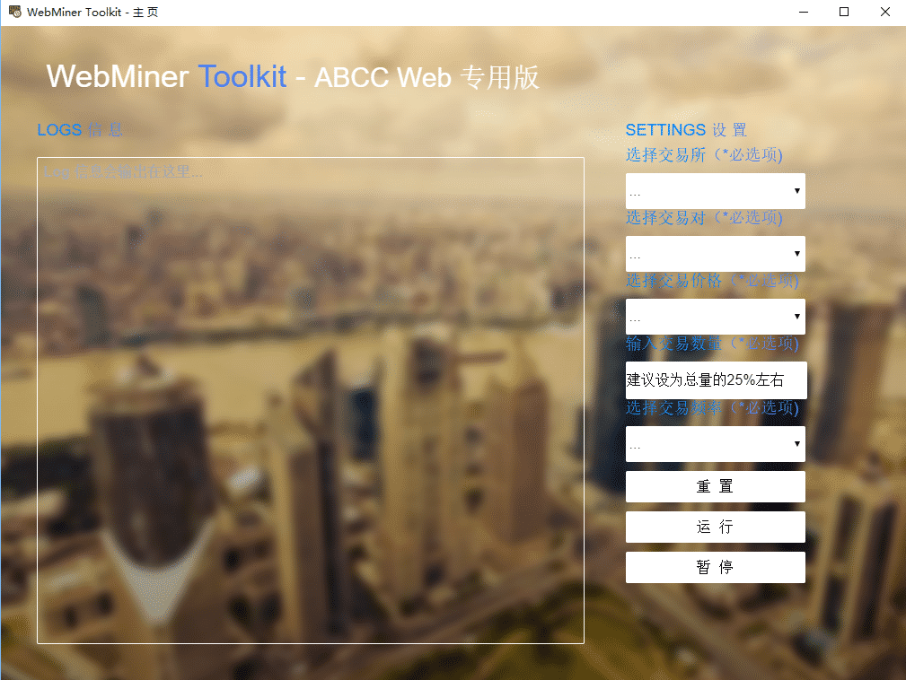
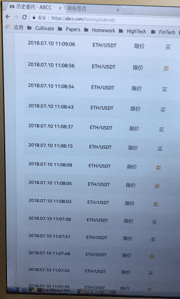

# WebMiner
> Crypto Currency Web Miner Tools, currently support abcc and coinpark


> WebMiner 是一款基于网页的交易即挖矿的刷单软件，不需要API，目前支持ABCC和Coinpark交易所,该工具不同于网页脚本，基于Google的Puppeteer开发，可以多开，突破交易频率限制，为部分ABCC创世挖矿用户，一个月创造了近10倍的回报。现将源代码开源，一同学习进步。
> [WebMiner](#webminer) specification

> 维护者:
[Paul Zhang](https://github.com/paulplayer)

## Demo GIF


## 目录
<!-- TOC depthFrom:1 depthTo:6 withLinks:1 updateOnSave:1 orderedList:0 -->

- [WebMiner](#webminer)
	- [Demo GIF](#demo-gif)
	- [目录](#目录)
	- [1. 安装](#1-安装)
		- [1.1 Windows 平台](#11-windows-平台)
			- [安装步骤：](#安装步骤)
		- [1.2 Mac 平台](#12-mac-平台)
			- [安装步骤：](#安装步骤)
		- [1.3 Linux 平台](#13-linux-平台)
			- [安装步骤：](#安装步骤)
	- [2. 使用](#2-使用)
		- [2.1 登录界面](#21-登录界面)
		- [2.2 注册界面](#22-注册界面)
		- [2.3 主界面](#23-主界面)
		- [2.4 运行结果](#24-运行结果)
	- [3. 注意事项](#3-注意事项)
		- [3.1 关于注册](#31-关于注册)
		- [3.2 关于运行时](#32-关于运行时)
		- [3.3 关于刷币数量设置](#33-关于刷币数量设置)
		- [3.4 关于撤销](#34-关于撤销)
	- [4. 声明](#4-声明)
	- [5. 资助我们](#5-资助我们)
	- [6. License](#6-license)

<!-- /TOC -->

## 1. 安装

### 1.1 Windows 平台

```bash
系统要求：OS>=win7,x32或x64均可
内存大小：>=1G
```
#### 安装步骤：

- step 1: 解压
- step 2: 双击运行，（首次运行用户点击注册，得到序列号后，向管理员申请激活码）
- step 3: 在程序根目录的config.json文件中的abcc下的用户名和密码字段，替换成您的abcc.com注册的用户名和密码，该步骤为自动登录使用，字段信息仅本地存储，不会后台传输，请放心使用，如不需要程序自动为您登录，可跳过此步骤
- step 4: 输入本软件注册用户名、密码，进行登录，进入程序的主界面
- step 5: 在主界面上选择/输入各个必选字段，点击运行，即跳出刷币网页，需要您滑动登录验证条，即可成功登录abcc.com,自动执行刷币，运行时请不要关闭刷币窗口！！！
- step 6: 点击停止程序自动停止。

### 1.2 Mac 平台

```bash
内存大小：>=1G
```
#### 安装步骤：

- step 1: 解压
- step 2: 双击运行，（首次运行用户点击注册，得到序列号后，向管理员申请激活码）
- step 3: 在程序根目录的config.json文件中的abcc下的用户名和密码字段，替换成您的abcc.com注册的用户名和密码，该步骤为自动登录使用，字段信息仅本地存储，不会后台传输，请放心使用，如不需要程序自动为您登录，可跳过此步骤
- step 4: 输入本软件注册用户名、密码，进行登录，进入程序的主界面
- step 5: 在主界面上选择/输入各个必选字段，点击运行，即跳出刷币网页，需要您滑动登录验证条，即可成功登录abcc.com,自动执行刷币，运行时请不要关闭刷币窗口！！！
- step 6: 点击停止程序自动停止。

### 1.3 Linux 平台

```bash
内存大小：>=1G
```
#### 安装步骤：

- step 1: 下载源代码并安装依赖
```bash
git clone https://github.com/paulplayer/WebMiner.git
> cd WebMiner
> npm install
```

- step 2: 运行，（首次运行用户点击注册，得到序列号后，向管理员申请激活码）

常规运行：
```bash
npm start
```
单独运行脚本：
```bash
git checkout abcc
node src/cli/arbitrage.abcc.demo.js
```
```bash
git checkout coinpark
node src/cli/arbitrage.coinpark.demo.js
```

- step 3: 在程序根目录的config.json文件中的abcc下的用户名和密码字段，替换成您的abcc.com注册的用户名和密码，该步骤为自动登录使用，字段信息仅本地存储，不会后台传输，请放心使用，如不需要程序自动为您登录，可跳过此步骤
- step 4: 输入本软件注册用户名、密码，进行登录，进入程序的主界面
- step 5: 在主界面上选择/输入各个必选字段，点击运行，即跳出刷币网页，需要您滑动登录验证条，即可成功登录abcc.com,自动执行刷币，运行时请不要关闭刷币窗口！！！
- step 6: 点击停止程序自动停止。

## 2. 使用

### 2.1 登录界面



### 2.2 注册界面



### 2.3 主界面



### 2.4 运行结果

单开刷单效果：



## 3. 注意事项

### 3.1 关于注册

源代码中隐去了注册需要用的公钥，可以在release中，下载试用版，解压缩密码: WebMiner，需要注册码的可以在[Issues](https://github.com/paulplayer/WebMiner/issues)里留言。

### 3.2 关于运行时

运行时请不要关闭刷币窗口！！！

### 3.3 关于刷币数量设置

建议每次刷币数量，设置为总资产25%左右

### 3.4 关于撤销

每5分钟自动运行一次撤销程序，程序会选择未成交的交易中较早的80%撤销，保留最新提交的20%,提高成交率。

## 4. 声明

本软件为自动执行交易程序的网页机器人，仅供个人自行选择使用，因个人使用造成的资产损失，本程序及其作者概不负责。

## 5. 资助我们

Cryptocurrency is welcomed.

[ETH](#): 0x007060e235b6B5954B41F72c4e2c24976F601FBa

## 6. License

[CopyRight](LICENSE) © 2016 WebMiner
